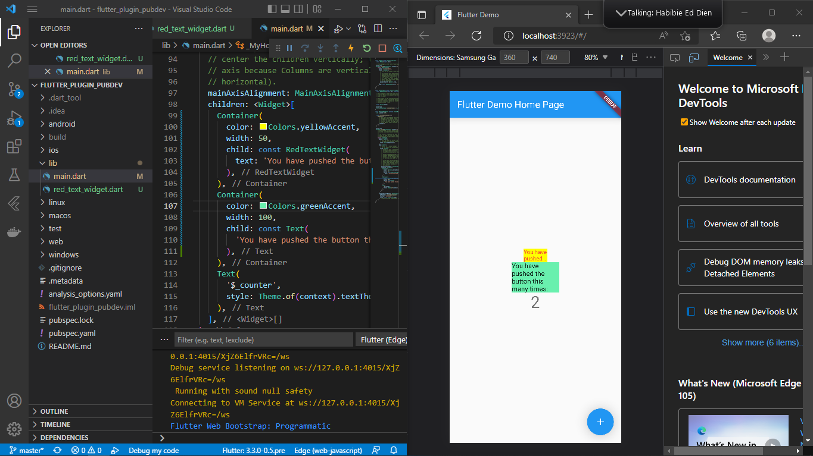

# TSA Mobile

## Praktikum
#### 1. Selesaikan Praktikum tersebut, lalu dokumentasikan dan push ke repository Anda berupa screenshot hasil pekerjaan beserta penjelasannya di file README.md!

Menampilkan hasil praktikum dengan menggunakan plugin auto_size_text, yang terdapat perbedaan diantara teks yang dibaris pertama dan baris kedua.
#### 2. Jelaskan maksud dari langkah 2 pada praktikum tersebut!
Menambahkan plugin auto_size_text yang berfungsi untuk mensinkronisasi otomatis ukuran teks atau mengubah ukuran teks secara dinamis agar pas sesuai batasnya.
#### 3. Jelaskan maksud dari langkah 5 pada praktikum tersebut!
Dengan menambahkan variabel text pada konstruktor maka akan dapat memanggil variabel tersebut melalui main.dart agar bisa tampil sesuai pemanggilan class RedTextWidget yang didalamnya terdapat return AutoSizeText
#### 4. Pada langkah 6 terdapat dua widget yang ditambahkan, jelaskan fungsi dan perbedaannya!
* Widget Container ke 1, yang berfungsi untuk memanggil class RedTextWidget yang dimana class tersebut memiliki widget AutoSizeText dengan berbagai parameter nya seperti warna teks, panjang baris, dan overflow.
* Widget Container ke 2, yang berfungsi hanya memanggil beberapa parameter saja seperti color, width, dan widget Text.
#### 5. Jelaskan maksud dari tiap parameter yang ada di dalam plugin auto_size_text berdasarkan tautan pada dokumentasi ini !
* `key*`
```
Mengontrol bagaimana satu widget menggantikan widget lain di tree.
```
* `textKey`
```
Mengatur key untuk widget Teks yang dihasilkan
```
* `style`
```
Style yang digunakan untuk sebuah teks seperti color, fontsize, dsb
```
* `minFontSize`
```
Batasan ukuran teks minimum yang akan digunakan saat mengubah ukuran teks secara otomatis.
Diabaikan jika presetFontSizes diatur.
```
* `maxFontSize`
```
Batasan ukuran teks maksimum yang akan digunakan saat mengubah ukuran teks secara otomatis.
Diabaikan jika presetFontSizes diatur.
```
* `stepGranularity`
```
Ukuran langkah di mana ukuran font sedang disesuaikan dengan batasan.
```
* `presetFontSizes`
```
Mendefinisikan semua ukuran font yang mungkin akan diatur.
Penting: presetFontSizes harus dalam urutan menurun.
```
* `group`
```
Menyinkronkan ukuran beberapa AutoSizeText
```
* `textAlign*`
```
Bagaimana teks harus disejajarkan secara horizontal.
```
* `textDirection*`
```
Arah teks. Ini memutuskan bagaimana nilai textAlign seperti TextAlign.start dan TextAlign.end diinterpretasikan.
```
* `locale*`
```
Digunakan untuk memilih font ketika karakter Unicode yang sama dapat dirender secara berbeda, tergantung pada lokal.
```
* `softWrap*`
```
Apakah teks harus putus pada jeda baris lunak.
```
* `wrapWords`
```
Apakah kata-kata yang tidak cocok dalam satu baris harus dibungkus. Default ke true untuk berperilaku seperti Teks.
```
* `overflow*`
```
Bagaimana visual overflow harus ditangani.
```
* `overflowReplacement*`
```
Jika teks melebihi batas dan tidak sesuai dengan batasnya, widget ini akan ditampilkan sebagai gantinya.
```
* `textScaleFactor*`
```
Jumlah piksel font untuk setiap piksel logis. Juga memengaruhi minFontSize, maxFontSize, dan presetFontSizes.
```
* `maxLines`
```
Jumlah maksimum baris opsional untuk teks yang akan dibentangkan.
```
* `semanticsLabel*`
```
Label semantik alternatif untuk widget teks
```

`Note: Parameter yang ditandai dengan * berperilaku persis sama seperti di Teks`


